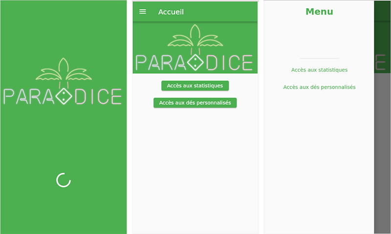
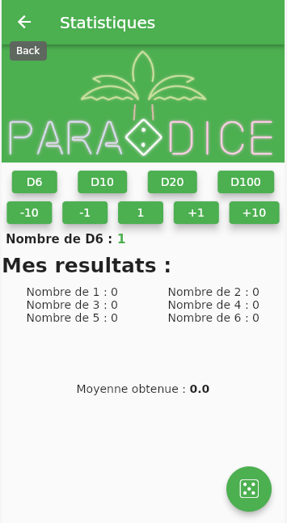
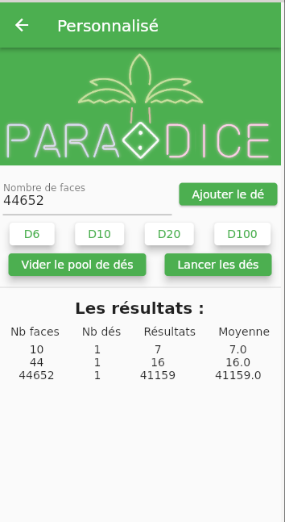

# Paradice

Paradice est une aplication codé en Flutter dans le cadre de mes études en BTS SIO option SISR.
Cette aplication permet de lancer des dés , qu'ils soit personallisé ou déjà créée et de récupérer les résultats 
et statistiques des différents lancés.

## Fonctionnement

L'application démarre sur un splashscreen de 3s, on est ensuite rediriger sur la page d'acceuil sur laquel se trouve les boutons pour accéder 
aux autre page soit les statistiques ou les dés personalisés. Et un menu qui amène aux même autre page.

### Page statistiques :

Sur la page statistiques , vous avez accés à différent dé : D6,D10,D20 et D100. Au lancement de la page un D6 est initialisé mais il est possible de le changer avec les boutons prévu à cette effet. Une fois le dé et la quantité choisi vous pouvez appuyer sur le bouton D5 en bas à droite de l'écran pour lancer le/les dé(s).Les résultats et statistiques du lancé s'afficheront.

Les statistiques affichés seront :

1. Le nombre de chaque faces sur lequel le ou les dés sont tombés
2. La moyenne des resultats de chaque dés lancé

### Page personnalisé :

Sur la page personnalisé l'utilisateur à toujours le choix entre les D6,D10,D20 et D100 mais à aussi la possibilité de créer un dé personnalisé avec un nombre de face souhaiter. L'utilisateur pourra toujours rajouter des dés soit en appyant sur les boutons D6,D10... pour les dés prédefini et sur le bouton "Ajouter le dé" pour les dés personnalisés. Une fois les dés choisi il pourra les lancer grâce au bouton "Lancer les dés" ce qui affichera les informations et résultats du lancé.

Les informations et résultats affichés seront :

1. Le nombre de face
2. Le nombre de dé
3. Les résultats du lancé
4. La moyenne des resultats du lancé

L'urilisateur à aussi la possibilité de vider le pool de dés avec le bouton prèvu à cette effet.

## Les fichiers

### Dice.dart 

Dice est une classe abstraite qui sert de "model" pour créer des dé de nombre de face differant comme avec les classes fille dice6,dice10... 
Elle posséde 2 attributs privés _nbface qui sert à savoir le nombre de face du dé et _resultatface qui est une variable qui sauvegarde le resultat du dé après chaque lancer.

### Dice6/10/20/100/X.dart 

Dice6/10/20/100/X sont des classes fille de Dice elles permettent la création de dé à 6/10/20/100/X faces (X étant un nombre choisi par l'utilisateur)

### Dicepool.dart

Dicepool est une classe abstraite qui sert de "model" pour créer des pool de dé differant comme avec les classes fille dice6pool,dice10pool...
Elle posséde 2 attributs privés _pool qui est une List où sont stocké les dés et _resultat une List où sont stocké les résultats de chaque dé.

### Dice6/10/20/100/Xpool.dart 

Dice6/10/20/100/Xpool sont des classes fille de Dicepool elles permettent la création d'un pool de  dé à 6/10/20/100/X faces uniquement. (X étant un nombre choisi par l'utilisateur)

## Video presentation du projet :

